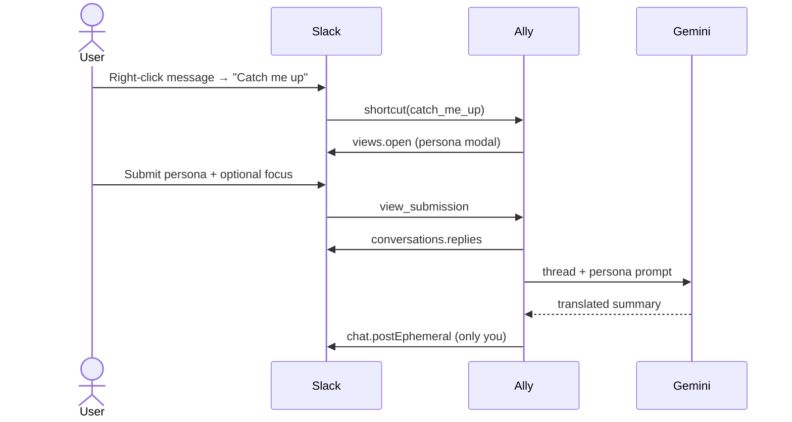
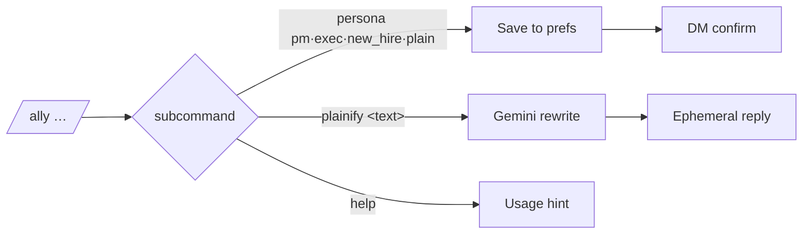
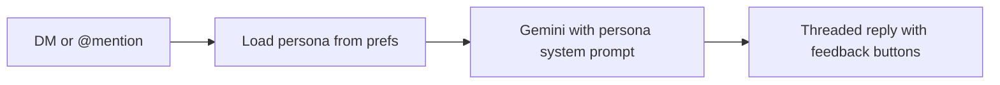
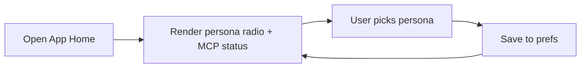

# AccessibilityAlly

[](https://nodejs.org)
[](https://docs.slack.dev/tools/bolt-js/)
[](https://ai.google.dev)
[](https://biomejs.dev)
[](#)

Every Slack thread is written for the people already in the room — acronyms unexplained, decisions implied, links assumed. **AccessibilityAlly** is the quiet translator who joins late and catches you up: a PM dropped into `#backend-platform`, a new hire on day three, a screen-reader user skimming for the decision, an ESL teammate parsing the jargon. Pick a persona, hit a shortcut, and the thread arrives rewritten for *you* — bottom line first, acronyms defined, decisions and owners surfaced, with a glossary at the end.

---

## Workflows

### Catch me up on a thread



### Slash command



### DM / @mention



### App Home persona switch



---

## Personas

| id         | for                                               |
| ---------- | ------------------------------------------------- |
| `pm`       | cross-functional visitor in a technical channel   |
| `exec`     | leader who needs the decision and the risk        |
| `new_hire` | someone with zero tribal knowledge                |
| `plain`    | plain-language, screen-reader & ESL friendly      |

---

## Run it

```sh
cp .env.sample .env   # fill in GOOGLE_API_KEY, SLACK_BOT_TOKEN, SLACK_APP_TOKEN
npm install
npm start
```
